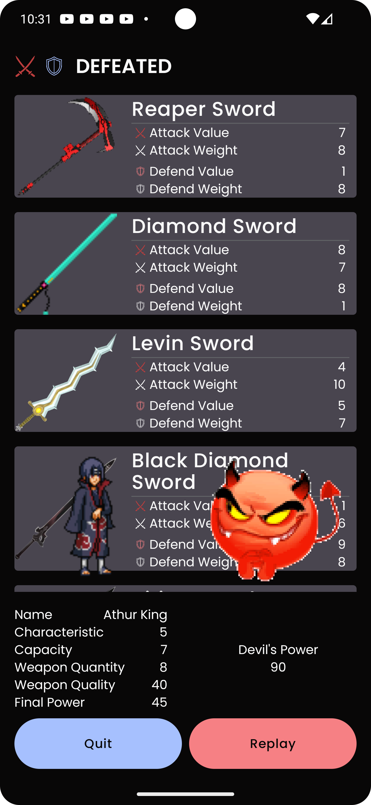

# KING3000

[//]: # (![KING3000 Logo](link_to_logo_image))

## Table of Contents
- [Introduction](#introduction)
- [Screenshots](#screenshots)
- [Features](#features)
- [Gameplay](#gameplay)
- [How to Play](#how-to-play)
- [Technologies Used](#technologies-used)
- [Contributing](#contributing)
- [Contact](#contact)

## Introduction
KING3000 is an engaging game that challenges players to strategize and battle against a powerful devil. Players control a warrior who must gather swords to increase their power and overcome formidable foes.

## Screenshots




## Features
- **Dynamic Gameplay**: Experience thrilling battles with varying outcomes based on your choices.
- **Strategic Decision-Making**: Choose whether to pick up swords, balancing value and weight for maximum power.
- **Intuitive Controls**: Easy-to-learn mechanics suitable for all players.

## Gameplay
In KING3000, players control a warrior and face off against a devil. The warrior can collect swords, which affect their final power. Victory, defeat, or a draw will result from the match, determined by the warrior's accumulated power.

### Game Objectives
- Defeat the devil by having a higher power level.
- Strategically choose which swords to collect to optimize your strength.

### Explanation
The game consists of 3 kind of object such as Warrior, Swords and Devil.
1. **Warrior**: The warrior consists of name, image, characteristic and physical power that means the inputted  warrior name, warrior visualization, warrior value and warrior max weight respectively. The warrior’s characteristic and physical power has to be picked randomly from 1 to 10.
2. **Sword**: The swords are a collection of shields and swords. Every item contains four main properties including attack value, attack weight, defend value and defend weight.  These values has to be from 1 to 10 by randomly. Since players strike to play a game, all the sword values has to choose randomly. Furthermore, the sword items need name and photo to visualize.
3. **Devil**: The devil only has power property. The value of the property is picked randomly from 1 to 100.

- **Game Action**: While playing games, players can either swipe left to choose swords or click on love button at the bottom of the game screen. On the other hand, players can either swipe right to skip swords or click on can close button being sticked at the bottom game screen.  Players might swipe up or down but this action does not affect chosen collection.
- **Game Over**: After players go through the suggested swords, the game could use algorithm below to check whether the player wins over the devil.

Below are the two integrity functions returning the values that the warrior can load as well as win, lose or draw the devil.
```
/**
 * The function is about to check how much values the warrior can carry on
 */
override fun loadSwordValue(
        attackValue: Long,
        attackWeight: Long,
        defendValue: Long,
        defendWeight: Long,
        capacity: Long
): Long {
    // Check if the warrior can take both items
    if (attackWeight + defendWeight <= capacity) {
        return attackValue + defendValue
    }
    // Check if the warrior can only take the attack item
    if (capacity in attackWeight..<defendWeight) {
        return attackValue
    }
    // Check if the warrior can only take the defend item
    if (capacity in defendWeight..<attackWeight) {
        return defendValue
    }
    // If both items' weights are individually within the capacity, return the one with the highest value
    if (attackWeight <= capacity && defendWeight <= capacity) {
        return max(attackValue, defendValue)
    }
    return 0L
}
```

```
/**
 * The function is about returning the game result 
 * whether the warrior wins over, is defeated or draws the devil
 */
override fun finishingGame(
    warrior: Warrior,
    devil: Devil,
    chosenSwords: List<Sword>
): GameResult {
    val capacity = warrior.physicalPower
    var chosenSwordQuality = 0L
    chosenSwords.forEach { sw ->
        val attackValue = sw.attackValue
        val attackWeight = sw.attackWeight
        val defendValue = sw.defendValue
        val defendWeight = sw.defendWeight

        chosenSwordQuality += loadSwordValue(
            attackValue = attackValue,
            attackWeight = attackWeight,
            defendValue = defendValue,
            defendWeight = defendWeight,
            capacity = capacity
        )
    }
    val finalWarriorPower = chosenSwordQuality + warrior.characteristic
    val pairTitles = if (finalWarriorPower > devil.power) {
        GameOver.VICTORY to "Victory"

    } else if (finalWarriorPower < devil.power) {
        GameOver.DEFEATED to "Defeated"
    } else {
        GameOver.DRAW to "Draw"
    }

    return GameResult(
        title = pairTitles.second,
        status = pairTitles.first,
        devil = devil,
        warrior = warrior,
        warriorFinalPower = finalWarriorPower,
        chosenSword = chosenSwords,
        weaponQuality = chosenSwordQuality
    )
}
```


## How to play
- Start the game and select your warrior.
- As you encounter swords, decide whether to pick them up based on their value and weight.
- Engage in battles with the devil and see if your final power is enough to win!

## Technologies Used
- **Language**: Kotlin, HTML
- **Framework**: Jetpack Compose

This project contains a detailed sample app that implements MVVM architecture using Koin, Jetpack Compose

## Contributing
We welcome contributions! To contribute to KING3000:

1. Fork the repository.
2. Create a new branch:
```bash
git checkout -b feature/YourFeature
```
3. Make your changes and commit them:
```bash
git commit -m "Add some feature"
```
4. Push to the branch:
```
git push origin feature/YourFeature
```
5. Open a pull request.

## Contact
For questions or feedback, please contact:

- Email: vuongdt92@gmail.com or vuongdotuan@gmail.com
- GitHub: https://github.com/VuongDo92
- Linkedin: https://www.linkedin.com/in/vuongdotuan/
```
Feel free to modify any sections to better fit your game's specifics!
```
